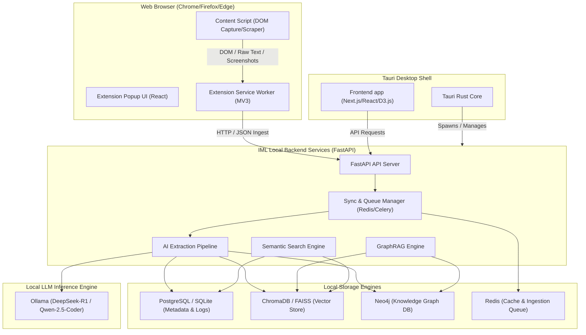
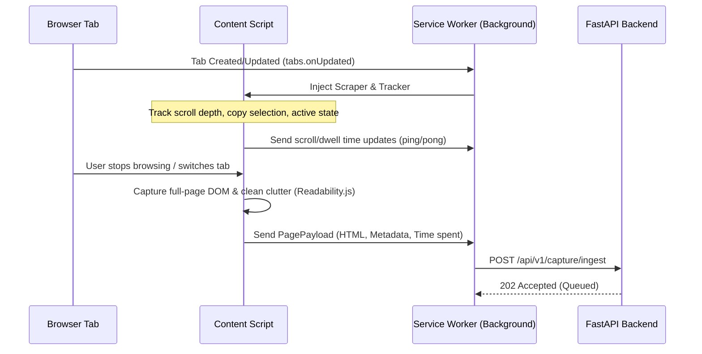
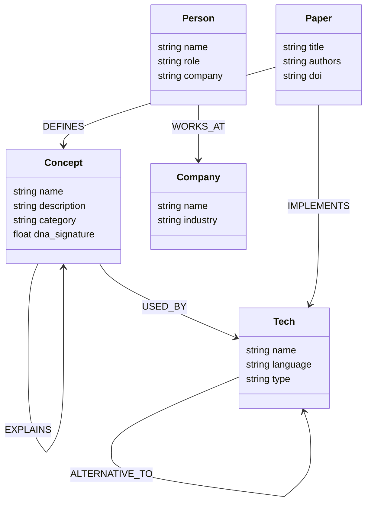

# Internet Memory Layer (IML): Architecture & Schema Specifications

This document defines the complete technical architecture and schema design for the **Internet Memory Layer (IML)** platform. IML is a production-grade, local-first, privacy-focused platform that turns browsing history into an queryable knowledge system.

---

## 1. Complete System Architecture

IML uses a local-first, hybrid desktop-service architecture. It combines a browser extension for ingestion with a Tauri desktop shell wrapping a Next.js UI, running a local Python FastAPI backend services suite.

### 1.1 High-Level Architecture Diagram


### 1.2 System Components
- **Browser Extension (Manifest V3)**: Captures web page HTML, scroll position, dwell time, takes screenshots, processes web requests, and sends data payloads to the local backend.
- **Tauri Desktop Shell**: A native OS wrapper written in Rust that boots the Python backend process locally, secures filesystems, manages local system tray integrations, and loads the Next.js React frontend.
- **FastAPI Backend**: Exposes high-performance REST and WebSockets interfaces. Handles core routing, schedules vectorization/graph builds, and integrates with NLP services.
- **AI Processing Pipeline**: Uses local HuggingFace `sentence-transformers` for real-time embedding generation and `Ollama` for running local models (like DeepSeek-R1 or Qwen) to perform entity and relationship extraction.
- **Unified Query Layer**: Combines standard SQL relational queries, graph traversals, vector similarities, and GraphRAG answers into one interface.

---

## 2. Browser Extension Architecture

The IML Browser Extension is designed for passive background capture without degrading browser performance.



### 2.1 Ingestion Payload Schema
```json
{
  "url": "https://github.com/microsoft/graphrag",
  "title": "GitHub - microsoft/graphrag: A modular graph-based Retrieval-Augmented Generation system",
  "referrer": "https://github.com/trending",
  "html_content": "<html>...</html>",
  "cleaned_text": "Microsoft GraphRAG is a modular graph-based RAG system...",
  "screenshot_base64": "data:image/png;base64,...",
  "metrics": {
    "scroll_depth_percent": 87.5,
    "dwell_time_seconds": 182,
    "interaction_count": 24
  },
  "timestamp": "2026-07-19T10:55:00Z"
}
```

---

## 3. Relational Database Schema (PostgreSQL/SQLite)

The relational schema tracks user preferences, captures logs, queue states, and links to vector/graph nodes.

```sql
-- Users Table (Supports local authentication and local profiles)
CREATE TABLE users (
    id UUID PRIMARY KEY DEFAULT gen_random_uuid(),
    username VARCHAR(100) UNIQUE NOT NULL,
    email VARCHAR(255) UNIQUE NOT NULL,
    created_at TIMESTAMP WITH TIME ZONE DEFAULT CURRENT_TIMESTAMP,
    updated_at TIMESTAMP WITH TIME ZONE DEFAULT CURRENT_TIMESTAMP
);

-- Captured Web Pages Log
CREATE TABLE page_logs (
    id UUID PRIMARY KEY DEFAULT gen_random_uuid(),
    user_id UUID REFERENCES users(id) ON DELETE CASCADE,
    url TEXT NOT NULL,
    title TEXT NOT NULL,
    domain VARCHAR(255) NOT NULL,
    favicon_url TEXT,
    screenshot_path VARCHAR(512),
    dwell_time_seconds INTEGER DEFAULT 0,
    scroll_depth_percent NUMERIC(5, 2) DEFAULT 0.0,
    importance_score NUMERIC(3, 2) DEFAULT 0.0,
    created_at TIMESTAMP WITH TIME ZONE DEFAULT CURRENT_TIMESTAMP,
    processed_at TIMESTAMP WITH TIME ZONE,
    status VARCHAR(50) DEFAULT 'queued' -- 'queued', 'processing', 'completed', 'failed'
);

-- User Notes and Annotations
CREATE TABLE annotations (
    id UUID PRIMARY KEY DEFAULT gen_random_uuid(),
    page_log_id UUID REFERENCES page_logs(id) ON DELETE CASCADE,
    user_id UUID REFERENCES users(id) ON DELETE CASCADE,
    selection_text TEXT,
    comment TEXT,
    color_hex VARCHAR(7) DEFAULT '#FFFF00',
    created_at TIMESTAMP WITH TIME ZONE DEFAULT CURRENT_TIMESTAMP,
    updated_at TIMESTAMP WITH TIME ZONE DEFAULT CURRENT_TIMESTAMP
);

-- Indexing for fast search retrievals
CREATE INDEX idx_page_logs_url ON page_logs(url);
CREATE INDEX idx_page_logs_domain ON page_logs(domain);
CREATE INDEX idx_page_logs_status ON page_logs(status);
```

---

## 4. Neo4j Graph Schema

The Knowledge Graph represents concepts, items, and their semantic relationships.



### 4.1 Node Property Schemas
* **Concept**
  * `id`: UUID (matches Vector ID)
  * `name`: String (Unique index)
  * `description`: String
  * `dna_fingerprint`: FloatArray (Concept evolution signature)
  * `importance`: Float
* **Tech (Technology)**
  * `name`: String
  * `license`: String
  * `github_url`: String
* **Paper (Research Paper)**
  * `title`: String
  * `publish_date`: Date
  * `citation_count`: Integer

### 4.2 Edge (Relationship) Properties
* **DEFINES / EXPLAINS**: `strength: Float` (Confidence score from LLM extraction).
* **CONTRADICTS**: `contradiction_reason: String`, `extracted_date: Date`.
* **DEPENDS_ON**: `min_version: String`.

---

## 5. Vector Database Architecture (ChromaDB / FAISS)

To power semantic search and GraphRAG context retrieval, all parsed page chunks, note fragments, and extracted entities are mapped as dense vectors.

### 5.1 Collection Configurations
1. **`page_chunks` Collection**
   - **Embedding Model**: `BAAI/bge-large-en-v1.5` (1024 dimensions) or `Qwen/Qwen2.5-72B-Instruct` embeddings (local API).
   - **Distance Metric**: Cosine Similarity.
   - **Chunk Size**: 512 tokens with a 64-token overlap.
2. **`entity_nodes` Collection**
   - **Embedding Model**: Same as page chunks.
   - **Properties Indexed**: Entity name, type, and short summary. Allows fuzzy mapping from unstructured queries directly into Neo4j graph nodes.

### 5.2 Metadata Fields on ChromaDB Vector Documents
```json
{
  "document_id": "page_log_uuid",
  "chunk_index": 4,
  "url": "https://arxiv.org/abs/2005.11401",
  "title": "Retrieval-Augmented Generation for Knowledge-Intensive NLP Tasks",
  "domain": "arxiv.org",
  "source_type": "academic_paper",
  "created_at": "2026-07-19T10:55:00Z"
}
```
