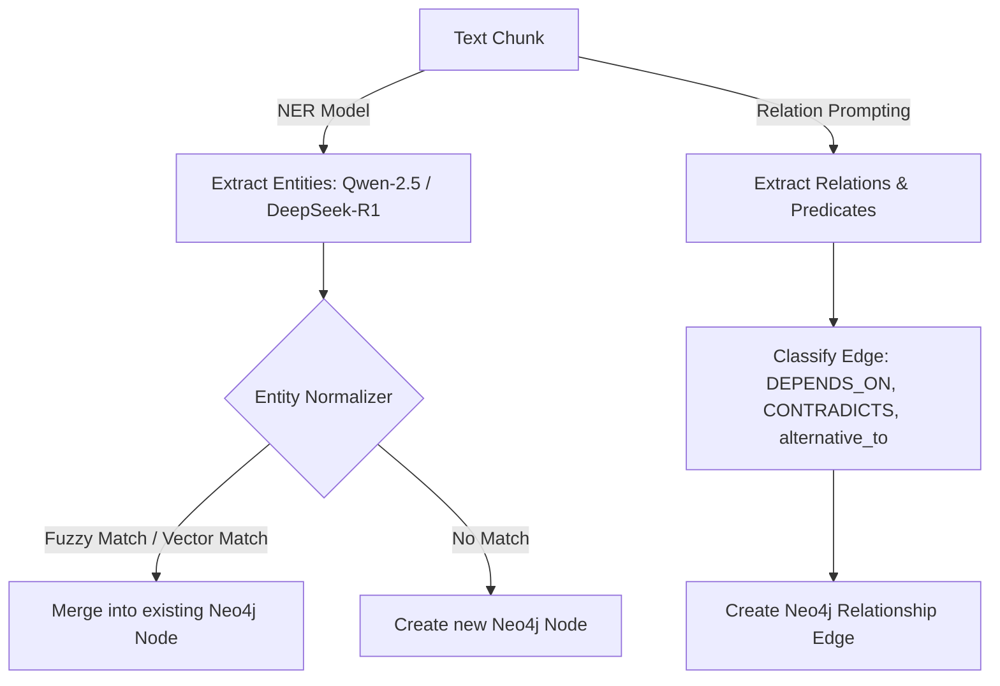
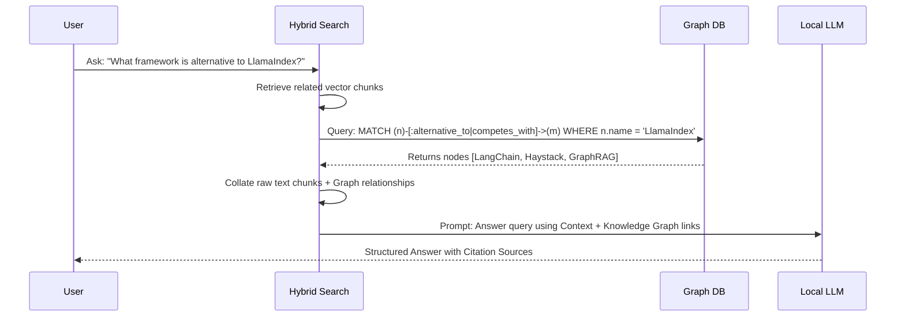

# Internet Memory Layer (IML): AI & Data Pipelines Specification

This document details the functional pipelines of the Internet Memory Layer (IML). It covers data ingestion, NLP extraction, semantic searching, GraphRAG execution, and timeline tracking.

---

## 1. Browser Capture & Ingestion Pipeline

The browser extension ingests web history asynchronously, filters noise, and queues documents for analysis.

```
[Raw Tab DOM]
      │
      ▼
[Filter Noise (Readability.js)] ───► Remove scripts, ads, headers, sidebars
      │
      ▼
[Payload Construction] ────────────► Add active dwell time, scroll percentage
      │
      ▼
[Ingestion API Router] ────────────► POST /api/v1/capture/ingest
      │
      ▼
[Redis Task Queue] ────────────────► Parallelized Celery/RQ job worker
      │
      ▼
[Database Logging] ────────────────► Save metadata to SQL, raw text to Vector Store
```

### Ingestion Details
- **Active Dwell Time Tracking**: Content scripts measure active tab visibility via Page Visibility APIs (`visibilitychange`) and user mouse/keyboard input triggers.
- **Deduplication Engine**: MD5/SHA256 hashes of the main text body are generated. If a hash already exists within a 24-hour window, only metadata (dwell time, scroll depth) is merged; re-embedding is skipped to conserve local GPU resources.
- **Image OCR Extraction**: Images in the scraped DOM are parsed through a local Tesseract OCR instance or local multi-modal LLM (e.g. LLaVA via Ollama) to index text embedded in images, tables, or slides.

---

## 2. Entity & Relationship Extraction Engine

Once a document is queued, the AI pipeline extracts concepts, entities, and semantic relationships using local model APIs.



### 2.1 Extraction Prompt Template
The backend calls local Ollama models using structured JSON schema configurations:
```json
{
  "system_prompt": "You are a Knowledge Extraction Engine. Extract all entities (Person, Tech, Concept, Company, Paper, Event) and relationships from the provided text. Return in JSON format matching the schema.",
  "user_text": "[Text Chunk Content]",
  "expected_schema": {
    "entities": [{"name": "GraphRAG", "type": "Concept", "summary": "Graph-based RAG framework"}],
    "relations": [{"source": "GraphRAG", "target": "Neo4j", "predicate": "USES", "confidence": 0.95}]
  }
}
```

---

## 3. Hybrid Semantic Search Engine

Semantic search in IML merges keyword relevance (BM25), vector similarity (ChromaDB), and graph connections (Neo4j).

```
User Query: "What framework competes with GraphRAG?"
    │
    ├─────────────────────────────┐
    ▼                             ▼
[BM25 Search]              [Vector Search]
(Matches key terms)        (Matches query embedding)
    │                             │
    └──────────────┬──────────────┘
                   ▼
       [Initial Top-K Results]
                   │
                   ▼
         [Neo4j Relationship Expand]
         (Fetch edges alternative_to / competes_with)
                   │
                   ▼
        [Cross-Encoder Reranker]
        (Score candidates for accuracy)
                   │
                   ▼
             [Final Results]
```

### 3.1 Ranking Algorithm Formula
The search engine scores each candidate document $d$ against query $q$:

$$Score(d, q) = w_{vector} \cdot Sim_{cos}(V_d, V_q) + w_{keyword} \cdot BM25(d, q) + w_{graph} \cdot Connections(d)$$

Where:
- $Sim_{cos}(V_d, V_q)$ is the cosine similarity score from ChromaDB.
- $BM25(d, q)$ is the normalized term frequency scoring.
- $Connections(d)$ is the degree centrality of related concept nodes in Neo4j.
- Weights are set to $w_{vector} = 0.5$, $w_{keyword} = 0.25$, and $w_{graph} = 0.25$ by default.

---

## 4. GraphRAG & AI Memory Pipeline

IML implements a local **GraphRAG** pipeline to answer questions spanning multiple sources.



### GraphRAG Context Template
```markdown
System: Use the following retrieved knowledge graph tuples and page chunks to formulate your answer.

Knowledge Graph Connections:
- (LangChain) <-[:alternative_to]- (LlamaIndex)
- (Haystack) <-[:alternative_to]- (LlamaIndex)
- (GraphRAG) <-[:extends]- (LangChain)

Retrieved Page Segments:
[Source: github.com/langchain] LangChain is a framework for building applications with LLMs...
[Source: github.com/haystack] Haystack is an open-source NLP framework...

Query: What framework is alternative to LlamaIndex?
Answer: ...
```

---

## 5. Concept DNA & Recommendation Engine

### 5.1 Concept DNA
Every concept has a vector signature showing its influence network. This is computed by running PageRank on the Neo4j graph combined with the average similarity vectors of all associated document chunks.
- **Fingerprint**: A dense 128-dimensional representation that summarizes the concept's position in the user's brain.
- **Concept Evolution**: Tracks changes in concept relations. For example, moving from `Machine Learning` to `Transformers` to `AI Agents`.

### 5.2 Recommendation Engine (Curiosity Engine)
- **Knowledge Gap Detection**: Scans the graph for high-similarity concepts that lack direct paths or link connections.
- **Study Plans & Quizzes**: Generates automated study questions using Ollama by targeting weak nodes (nodes with low revisit rates or low importance scores).
- **Spaced Repetition Scheduler**: Computes an optimal revisit score based on user interaction telemetry:
  $$RevisitScore = DwellTime \times (2^{-\Delta t / Halflife})$$
  Where $\Delta t$ is the time elapsed since the last read and $Halflife$ is derived from user importance settings.
